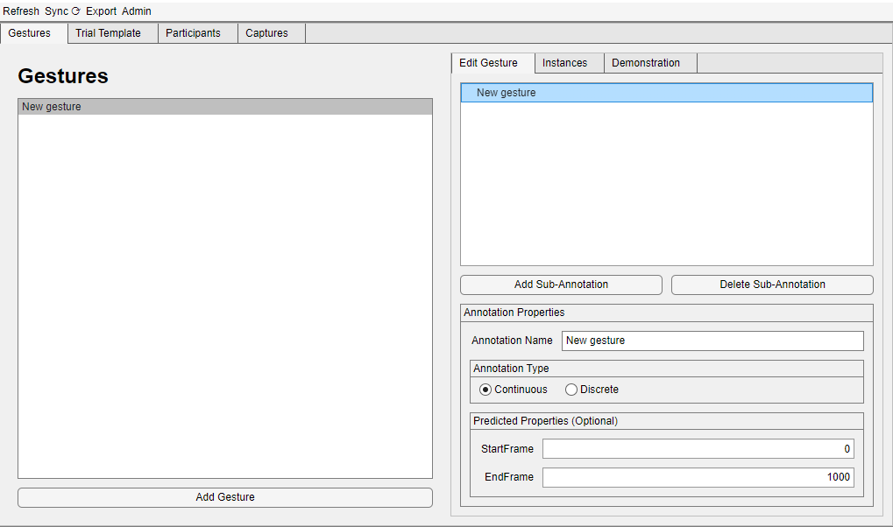

# GestureLogger
## Purpose
This application has been built to make the creation of
hand-gesture datasets easier. It facilitates the asynchronous 
setup, capture, annotation and export of this data, 
with the use of [WebXR](https://developer.mozilla.org/en-US/docs/Web/API/WebXR_Device_API)
enabled VR headsets as the capture device.

Modern VR headsets have the ability to record the hand-skeletal
data of the user. This tool harnesses that capability to make capturing
hand data easy. Simply:
 - Define your gesture classes (clap, grip, etc.)
 - Create trials which include multiple gestures
 - Push trials to specific participants on the server
 - Asynchronously download these trials from the server after
 the participant has performed them on their VR headset
 - Annotate the captured data in batches
 - Export the captured data to a dataset

## Installation
You can install and run a version of this app through the standalone
installer: [unimplemented link]()

You can also run this by cloning the repository  
```console
$ git clone https://github.com/Saatvik-Lochan/GestureLogger.git
```
and opening [`Login.mlapp`](Login.mlapp) with [MATLAB](https://uk.mathworks.com/products/matlab.html).

## Usage
The usage of this application is split into three main parts:
 - [Setup the project](#setup)
 - Capture the data
 - Annotate and export


### ⚠️ Hosting servers
It is recommended that you host your own servers (see 
[WebGestureCapture](https://github.com/Saatvik-Lochan/WebGestureCapture.git) 
and [WebGestureCaptureBackend](https://github.com/Saatvik-Lochan/WebGestureCaptureBackend.git)
for instructions on how to host).

**TODO - add instructions for changing server url**

There is no guarantee that the default servers will be able to serve 
your requests. Though you are welcome to use the default servers to 
trial the software. 

### Setup
#### Register and Login
On opening the application you will first have to register your project
with the server. 

You can then login by selecting the `.json` project file with the name
of the project you registered last time

> If the server does not respond, you might have to host your own 
[server](#⚠️-hosting-servers).

#### Creating Gesture Classes

*Outline of the relationship between annotations*

You can create multiple `gesture classes`. Each is coupled to an `annotation`.
An `annotation` can either be `continuous` or `discrete`. 

A `discrete` annotation  has a single integer value `triggerFrame` while a 
`continuous` annotation has a beginning, `startFrame`, and an end, `endFrame`.

`continuous` annotations can have children called `sub-annotations`, which
are functionally the same as `annotations` but can not be coupled to a
`gesture class`.

You can create new `gesture classes` by clicking `Add Gesture`. You 
can edit the annotation coupled with it in the right hand pane - adding
`sub-annotations`, changing the type, the name, etc.



The predicted properties tab is optional, and will be used
to populate the default annotation values.

## Extension
To add functionality, you must have access to [MATLAB AppDesigner](https://uk.mathworks.com/products/matlab/app-designer.html). Then
you can simply open [`Login.mlapp`](Login.mlapp) to start.

You can run a development session from within MATLAB, and you
can build a standalone application with the [Application Compiler](https://uk.mathworks.com/help/compiler/applicationcompiler-app.html).