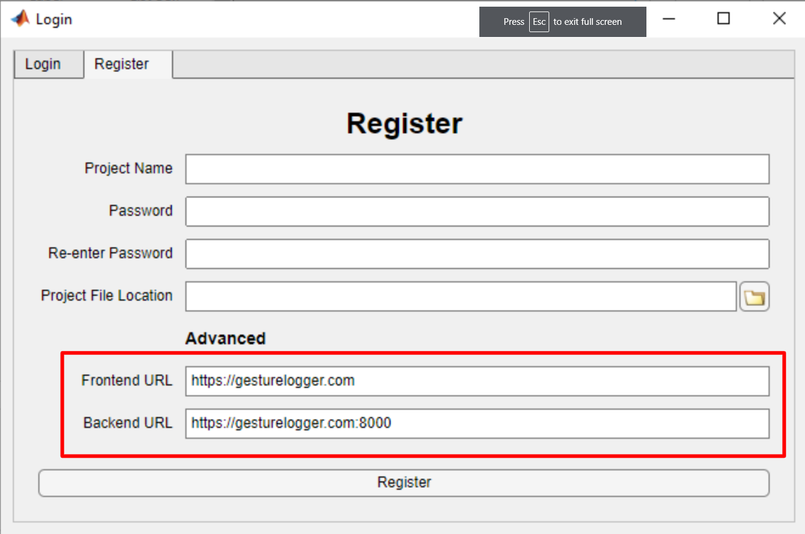
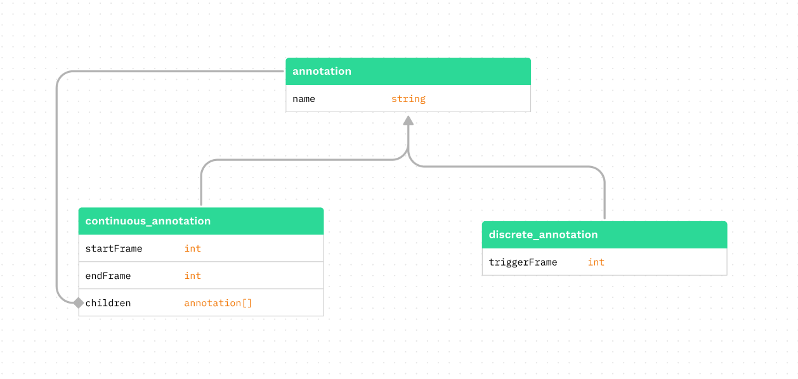
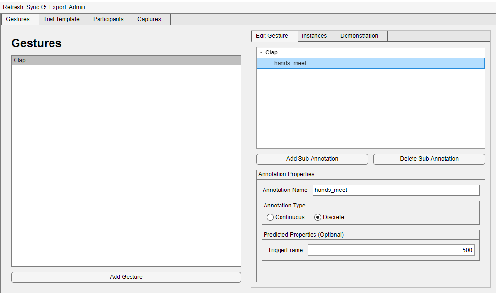
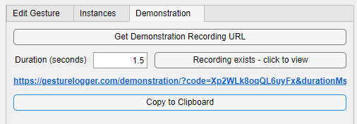
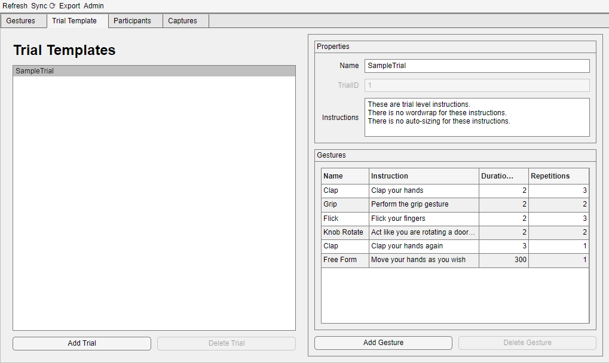
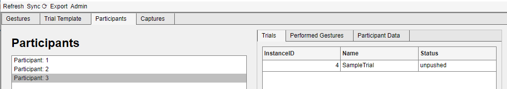
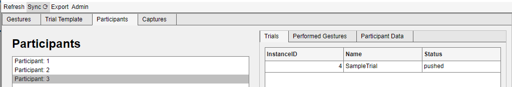
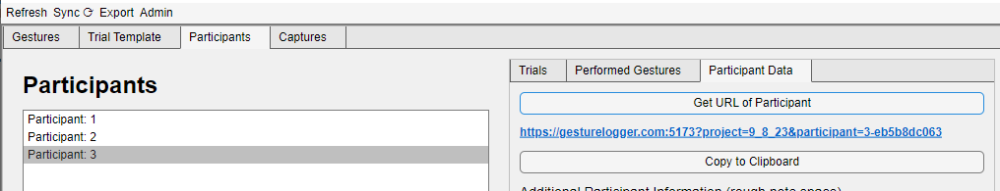
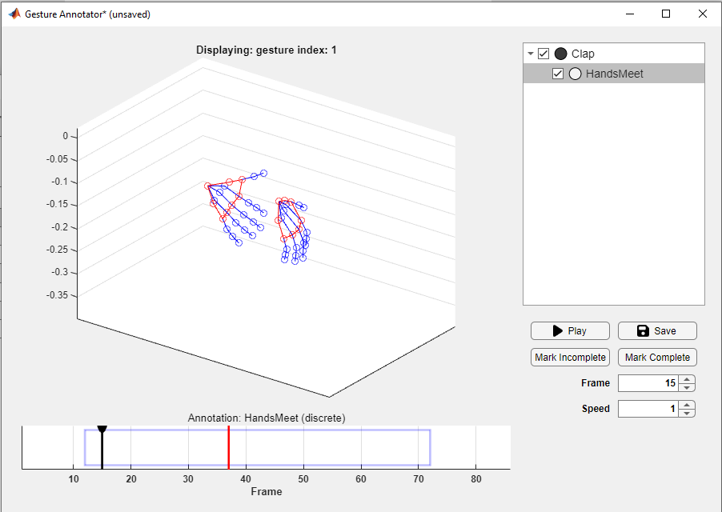
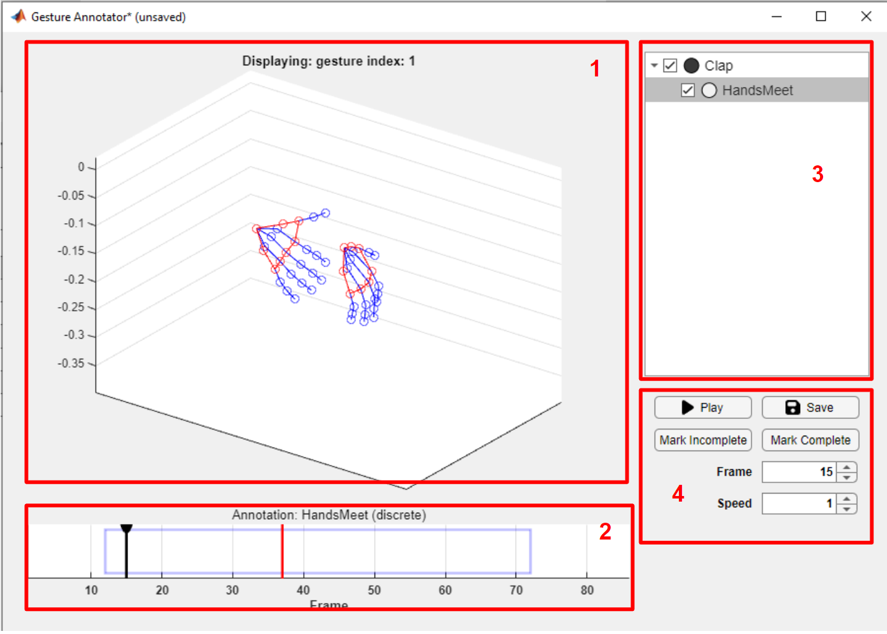

# GestureLogger
# Table of Contents
- [GestureLogger](#gesturelogger)
- [Table of Contents](#table-of-contents)
- [Purpose](#purpose)
- [Installation](#installation)
- [Usage](#usage)
  - [Hosting servers](#hosting-servers)
  - [Setup](#setup)
    - [Register and Login](#register-and-login)
    - [Creating Gesture Classes](#creating-gesture-classes)
    - [Adding Demonstrations](#adding-demonstrations)
    - [Creating Trial Templates](#creating-trial-templates)
    - [Adding Participants and Pushing Trials](#adding-participants-and-pushing-trials)
  - [Capture](#capture)
    - [Getting the URL](#getting-the-url)
    - [Opening the URL on the VR Headset](#opening-the-url-on-the-vr-headset)
    - [Making the participant perform the trial](#making-the-participant-perform-the-trial)
    - [Downloading the captured data](#downloading-the-captured-data)
  - [Annotate and Export](#annotate-and-export)
    - [Finding the right gesture](#finding-the-right-gesture)
    - [Annotating the gesture](#annotating-the-gesture)
    - [Exporting the dataset](#exporting-the-dataset)
  - [Gesture Annotator](#gesture-annotator)
    - [The Gesture View](#the-gesture-view)
    - [The Timeline](#the-timeline)
    - [The Annotation View](#the-annotation-view)
    - [The Control Panel](#the-control-panel)
  - [Export Format](#export-format)
    - [Data File Format](#data-file-format)
    - [Annotation File Format](#annotation-file-format)
    - [Encouraged Workflow](#encouraged-workflow)
  - [Useful Notes](#useful-notes)
    - [Editing and Deleting](#editing-and-deleting)
    - [Menubar](#menubar)
    - [Annotation Status](#annotation-status)
- [Known Bugs](#known-bugs)
- [Extension](#extension)
- [TODO](#todo)


# Purpose
This application has been built to make the creation of
hand-gesture datasets easier. It facilitates the asynchronous 
setup, capture, annotation and export of this data, 
with the use of [WebXR](https://developer.mozilla.org/en-US/docs/Web/API/WebXR_Device_API)
enabled VR headsets as the capture device.

Modern VR headsets have the ability to record the hand-skeletal
data of the user. This tool harnesses that capability to make capturing
hand data easy. Simply:
 - Define your gesture classes (clap, grip, etc.)
 - Create trials which include multiple gestures
 - Push trials to specific participants on the server
 - Asynchronously download these trials from the server after
 the participant has performed them on their VR headset
 - Annotate the captured data in batches
 - Export the captured data to a dataset

# Installation
You can install and run a version of this app through the standalone
installer: [releases](https://github.com/Saatvik-Lochan/GestureLogger/releases)

You can also run this by cloning the repository  
```console
$ git clone https://github.com/Saatvik-Lochan/GestureLogger.git
```
and opening [`Login.mlapp`](Login.mlapp) with [MATLAB](https://uk.mathworks.com/products/matlab.html).

# Usage
The usage of this application is split into three main parts:
 - [Setup the project](#setup)
 - [Capture the data](#capture)
 - [Annotate and export](#annotate-and-export)

There are some [notes](#useful-notes) that might come in useful.
Additionally you can see the [export format](#export-format) and
the [gesture annotator](#gesture-annotator).

## Hosting servers
It is recommended that you host your own servers:
- [WebGestureCapture](https://github.com/Saatvik-Lochan/WebGestureCapture.git) 
is the frontend that serves the pages on which the participants perform
the gestures
    - default: https://gesturelogger.com
- [WebGestureCaptureBackend](https://github.com/Saatvik-Lochan/WebGestureCaptureBackend.git)
is the backend that stores the captured data and communicates with the
application
    - default: https://gesturelogger.com:8000

> Hosting your own server will require a SSL certificate, as WebXR only works
> with https

You do not have to host both servers. You can use the default frontend at 
https://gesturelogger.com along with your own backend. You can mix 
and match these servers - as long as you specify which ones you are using
when creating a project.



The advantages of hosting your own backend server are:
- You have complete control over and privacy of captured data
- You are not limited by the default server's data capacity and bandwidth
- You can change the server settings as to never delete data
- You will never lose data to an external crash
- You will never experience downtime

Additionally, it is quite easy to set up. If easier, you could set it up
on the same machine you run the application from - running it whenever
a participant needs to perform a gesture.

> There is no guarantee that the default servers will be able to serve 
your requests. Though you are welcome to use the default servers to 
trial the software. 

## Setup
### Register and Login
On opening the application you will first have to register your project
with the server. 

You can then login by selecting the `.json` project file with the name
of the project you registered last time

> If the server does not respond, you might have to host your own 
[server](#hosting-servers).

### Creating Gesture Classes

*Outline of the relationship between annotations*

You can create multiple `gesture classes`. Each is coupled to an `annotation`.
An `annotation` can either be `continuous` or `discrete`. 

A `discrete` annotation  has a single integer value `triggerFrame` while a 
`continuous` annotation has a beginning, `startFrame`, and an end, `endFrame`.

`continuous` annotations can have children called `sub-annotations`, which
are functionally the same as `annotations` but can not be coupled to a
`gesture class`.

You can create new `gesture classes` by clicking `Add Gesture`. You 
can edit the annotation coupled with it in the right hand pane - adding
`sub-annotations`, changing the type, the name, etc.



The predicted properties panel is optional, and will be used
to populate the default annotation values.

### Adding Demonstrations
You can add demonstrations to the gestures that will be displayed to 
participants by going to the `Demonstration` tab. The resulting link should be
[opened with a VR headset](#opening-the-url-on-the-vr-headset). After following
the instructions, the demonstration should appear in any trials using that 
`gesture class`. The link will expire after a few minutes.



You can preview a recorded demonstration by clicking on
`Recording exists - click to view`.

https://github.com/Saatvik-Lochan/GestureLogger/assets/67321822/ca84f580-0fb9-4586-876a-b61103eb4d00

### Creating Trial Templates
A `trial` is the unit of data capture from the perspective of the
application. You must put gestures in a `trial template` before
you can send them to the VR headset for data capture. 

It consists of multiple `gesture classes` in a
particular order. Each `gesture class` is mapped to 
 - an instruction - *text which is displayed before a participant
 must perform a gesture*
 - a duration - *the duration in seconds that the participant's 
 hands must be recorded for*
 - a number of repetitions - *the number of times this `gesture 
 class` must be repeated*

these dictate how the trial will be displayed to the user during
the VR experience. 

A `trial template` also includes some trial-level properties, such
as a name and a trial-level instruction (which will be displayed
before any of the gestures).



> None of the instruction text has word-wrap or auto-sizing, you
might want to test that the text looks alright before you use the
trial in a project.

### Adding Participants and Pushing Trials
Now that you have some `trial templates` set up, you can add 
`participants` and then push `trials` onto them - this works in
two parts:
1. First create a participant, and add a `trial` to it

2. Sync the project with the server to push the `trial` to the server


> The sync button is in the menu bar at the top left of the app 

You may also add any useful information about a participant 
(such as an email, or a name) in a text box located under the `Participant Data` tab.

## Capture
The project has now been set up and the data capture can start.
This works as follows:
1. [Get a URL from the application](#getting-the-url) 
2. [Open the URL on the VR Headset](#opening-the-url-on-the-vr-headset)
3. [Make the participant perform the trial](#making-the-participant-perform-the-trial)
4. [Download the captured data from the server](#downloading-the-captured-data)

### Getting the URL
Each participant will have their own URL. This URL will not change,
and they will be able to access any pending trials (i.e. trials
which have been pushed but not completed) through this URL.



### Opening the URL on the VR Headset
This URL must now make its way to a VR Headset. The only requirement
on this headset is that it must have a [WebXR](https://developer.mozilla.org/en-US/docs/Web/API/WebXR_Device_API)
enabled browswer. A few common headsets which support this are:
- Quest
- Hololens
- Magic Leap One
- ARCore devices

And so on - a more complete list can be found [here](https://immersive-web.github.io/webxr/explainer.html#target-hardware).  

> How you move the URL to the headset is up to you, however we 
recommend you bookmark this URL on the headset's browser.

### Making the participant perform the trial
The participant must open the URL, and click `Enter VR` and 
follow the instructions to perform the `trial`.

> We recommend you show them the below video (or a similar one) and explain
the procedure to make things clear 

https://github.com/Saatvik-Lochan/GestureLogger/assets/67321822/e94848a3-3b23-446f-8b89-ec8c5558716c

Once done, they are prompted to remove the headset. The trial
can be performed anywhere, and at anytime, as long as they
have the headset. This allows for en-masse collection of data
once participants have gotten the hang of recording gestures.

### Downloading the captured data
This is as simple as clicking the `Sync` button in the menu bar.
The data can be downloaded from the server for up to 3 days after it 
was recorded. This time can be changed or removed entirely if you 
decide to [host your own servers](#hosting-servers). 

## Annotate and Export
This involves three steps:
1. [Finding the gesture to annotate](#finding-the-right-gesture)
2. [Annotating the gesture](#annotating-the-gesture)
3. [Exporting the dataset](#exporting-the-dataset)

### Finding the right gesture
Downloaded gesture can be found in three main ways:
- By `gesture class` - *navigate to the `Gestures` tab then `Gesture 
 Instances`*
- By `participant` - *navigate to the `Participants` tab then `Performed 
 Gestures`*
- By annotation status - *navigate to the `Captures` tab*

### Annotating the gesture
Select the `gesture instance` in the table, and then select `Open
Gesture Annotator`. You may have to wait for the new application to open.

See [Gesture Annotator](#gesture-annotator) for details on 
using this part of the application.

### Exporting the dataset
Select `Export` then `exportSHREC` in the menubar to open the export window. 
Only annotations marked as `completed` are added to any export (see 
[annotation status](#annotation-status)).

The format string allows you to customise the name of files which store
the gesture data. These are the modifiers you can use in the format string:

> A `gesture instance` is an instance of a performed gesture. Each `gesture
instance` has its own data file with captured hand data.

| modifier | description |
| -------- | ----------- |
| `%n` | The name of the class of the `gesture instance` |
| `%N` | The name of the trial the `gesture instance` was performed in |
| `%g` | The id of the `gesture instance` given by the internal database |
| `%G` | The id of the `gesture class` of this `gesture instance` given by the internal database |
| `%t` | The id of the `trial instance` of this `gesture instance` given by the internal database |
| `%T` | The id of the `trial template` of this `gesture instance` given by the internal database |
| `%p` | The index position of `gesture instance` within its `trial template` |
| `%P` | The id of the `participant` who performed this `gesture instance`|
| `%i` | The instructions attached to this `gesture instance` in its `trial template` |
| `%r` | The number of repetitions of this `gesture instance` in its `trial  template`|
| `%d` | The duration in seconds of the data recorded for this `gesture instance` |
| `%e` | Any additional participant information. See [known bugs](#known-bugs). |
| `%s` | `1` if the gesture is a stream type, `0` otherwise |

> The `%r` modifier only reports the number of repetitions directly mapped
to the `gesture class` - not the total number of repetitions in the trial. 
See [trial templates](#creating-trial-templates). 

> See [export format](#export-format) for more details on the output of the 
export.

## Gesture Annotator

The gesture annotator is the part of the application that 
deals with the process of annotating the captured gesture data.
This is done by adjusting both `continuous` and `discrete` annotations
until they match the captured data. This data will be included under the
`annotations` folder in the export.

In short, you can use the gesture annotator to view the captured gesture,
and edit its annotations.



*A screenshot of the gesture annotator window*

The labels correspond to the following
1. [the gesture view](#the-gesture-view)
2. [the timeline](#the-timeline)
3. [the annotation view](#the-annotation-view)
4. [the control panel](#the-control-panel)

### The Gesture View
The gesture view is the part of the application where you can see the 
gesture itself modelled as a plot of connected joints. This is a 
standard [MATLAB 3D plot](https://uk.mathworks.com/help/matlab/ref/plot3.html)
and thus inherits all of the controls which are available to them, this 
includes:
- the ability to rotate the plot
- the ability to mark hand joints and see the co-ordinates
- the ability to pan and zoom

> If you choose to use the plot controls, ensure you disable
them before interacting with the timeline, otherwise you
might encounter some bugs.

### The Timeline
The timeline has 3 important components: the cursor, the annotations, and the
annotation subtitle.

The cursor indicates the current frame displayed in the [gesture view](#the-gesture-view)
and can be dragged with the LMB or moved with the use of the arrow keys 
(additionally press `shift` to move the cursor faster).

The annotations are the blue rectangles (`continuous`) and red vertical lines
(`discrete`). Only one annotation can be selected at any given moment - this 
annotation will be opaque while the others will be semi-transparent. 
Additionally this annotation will be selected in the [annotation view](#the-annotation-view)
and in the annotation subtitle.

The selected annotation can be dragged with the RMB, or moved to the 
current cursor position by pressing `a` on the keyboard.

The selected annotation can be changed by clicking on an annotation with the
MMB, or by holding `alt` with the LMB. It can also be changed by selecting
it in the [annotation view](#the-annotation-view).

### The Annotation View
The annotation view shows the `annotations` and their `sub-annotations` (see
[creating gesture classes](#creating-gesture-classes)). 

Selecting an annotation in the annotation view will do two things:
- Select that annotation in the timeline
- Move the current frame to that annotation and start playing it if it is 
`continuous`

The small coloured circle to the left of the annotation name indicated whether
the current frame is within that annotation. 

You can hide an annotation in the timeline by unchecking it in the annotation
view.

### The Control Panel
This panel is mostly self-explanatory. You can 
 - Play/Pause
 - Change playback speed
 - Jump to a frame
 - Save the annotation
 - Mark annotation as complete/incomplete

 An annotation must be marked as complete for it to be included in an export
 (the gesture annotator must be closed before an annotation marked as 
 complete will be updated as so in the main window).

 > Marking a gesture as complete will not save it. You must save it manually 
 as well.

## Export Format
The `exportSHREC` export format will export a dataset similar to that curated
in the [SHREC dataset](https://paperswithcode.com/dataset/shrec).

```tree
- <project name>-export-<DD-MM-YY_HH-MM-SS>
	- data
        // one for each recorded gesture
		- <name given by format_string>.csv
	- annotations
        // one for each gesture class
		- <gesture class name>.csv
```
> See [format string](#exporting-the-dataset).

### Data File Format
Each data file will itself be a `.csv` file with the 359 columns of two types
- Position data (350 columns)
- Time data (2 columns - `startTime` and `endTime`)
    - `startTime` - the time at which this frame's capture started in milliseconds
    - `endTime` - the time at which this frame's capture ended in milliseconds
- Camera pose (7 columns)

Each row in the `.csv` file is one frame of captured data, and is in 
chronological order.

A position header will be similar to: `l0_pos_x`. 
- The first character `l` indicates the left hand (`r` for right)
- The second part is a number from 0 to 24 corresponding to a hand
joint as laid out in the [WebXR Hand Input Specification](https://www.w3.org/TR/webxr-hand-input-1/#skeleton-joints-section)
- `pos` indicated that this column holds information on the position of the joint.
`quat` would indicate the quaternion for that joint.
- Finally `x` indicated that this column holds the `x` co-ordinate of the data.
`pos` can have `x, y, z` while `quat` can have `x, y, z, w`.

Therefore the `l0_pos_x` column gives us the left-hand wrist's x position.

### Annotation File Format
The annotation file is also a `.csv` file with one row per `gesture instance`
of that `gesture class` (there is one annotation file per `gesture class`).

Each row is of the following form,
```
<gesture instance id>(,<annotation_name>, <annotation_data>)*
```
where `<annotation data>` can be either `continuous` or `discrete`
```
<continuous annotation_data> = <start_frame>,<end_frame>
<discrete annotation_data> = <trigger_frame>
```

`<gesture instance id>` is the id of the `gesture instance` described
in that row. The `<gesture instance id>` also goes by `giid` or can be accessed
by the required `%g` modifier in the [format string](#exporting-the-dataset).

The part in parantheses exists for each `annotation` or `sub-annotation`, and
the order is not specified.

For example, consider a `gesture instance` with id `1` of the annotation 
`Clap`, with a sub-annotation `HandsMeet`:
```
Clap (continuous) - startFrame: 100, endframe: 350
    - HandsMeet (discrete) - triggerFrame: 200
```

This would give us a row like
```
1,Clap,100,350,HandsMeet,200
```

> Although it might seem that since each gesture class has the same format of
annotations, the `<annotation_name>` is redundant, it has been
included for ease of use, to mimic the SHREC dataset, and on the off chance 
that someone edits the annotation of a gesture after already annotating some 
gestures.

### Encouraged Workflow

The encouraged workflow is to:
1. Mark all the required gestures as completed.
2. Export those gestures, inluding relevant information in the format string.
3. Sort and filter those gestures during analysis with the help of the file 
names given by the format strings.

## Useful Notes
### Editing and Deleting
There is no provision to delete trials, participants or gesture. 

If you want to edit a trial, ensure you do it **before** you 
you push it to a participant. 

If you want to edit a gesture, ensure you do it **before** you annotate
any gesture instance of that gesture. 

If you have changed a gesture, and 
want the annotation to propagate to any previously annotated gestures - 
you must delete the annotation file for that gesture (See **Admin** in the
[menubar](#menubar)).

### Menubar
The menubar has 4 items:
- Refresh - updates the GUI if it appears to be stuck
- Sync - upload unpushed trials and download completed ones
- Export - export completed gestures
- Admin - get the locations of important folders and URLs 

### Annotation Status
A gesture can have one of three values as an annotation status
- `unannotated` - this implies that this gesture has never been opened in the 
[gesture annotator](#gesture-annotator) (i.e. internally, the annotation file has not been created).
- `incomplete` - this implies that the gesture has been opened, but the user
has not marked it as complete.
- `complete` - the user has marked the gesture annotation as complete.

> A geture must be marked as `complete` to be included in an
> [export](#exporting-the-dataset)

# Known Bugs
- **Bug:** Experiencing extreme lag and stuttering when using the [gesture 
annotator](#gesture_annotator)
  - **Fix:** Your gesture capture likely has large gaps between frames, due
             to a faulty recording of the data. The best option is to discard 
             that gesture.
- **Bug:** A project can not be created since one with that name already, 
           exists even though the previous creation had supposedly failed.
  - **Fix:** Find the location of the project folders and delete them (these
             are not the project file, though that also must be deleted). You 
             can find its location by opening another project and going to
             **Admin > DataFolder**
- **Issue:** No sanitation of user input in the participant info section


# Extension
To add functionality, you must have access to [MATLAB AppDesigner](https://uk.mathworks.com/products/matlab/app-designer.html). 
Then you can simply open [`Login.mlapp`](Login.mlapp) to start.

You can run a development session from within MATLAB, and you
can build a standalone application with the [Application Compiler](https://uk.mathworks.com/help/compiler/applicationcompiler-app.html).

# TODO
- [ ] README updates
    - [ ] Fix unimplemented links 
    - [ ] Record short video for the trials 
- [x] Add cron job to delete old files
- [x] Add capability to choose backend server in frontend
- [x] Add ability to change both server through application
- [x] Add 'redo' ability and record data around how many retries etc.
- [x] Fix bug where last gesture was not recorded
- [ ] Fix bug where participant url not showing in the test build
- [ ] Make loadFont more transparent (try to load in index.html)
- [ ] Make assigning to frameListeners explicit (no silent 
overwriting of listeners)
- [ ] Store metadata in server - and build route to serve it
- [ ] Write documentation for the buttons (`clickable.ts`) 
- [x] Fix left/right hand bug
- [x] Add ability to get more info on a gesture instance through a pop up box
- [x] Add feedback for recording gestures (make it known that a gesture for
this type has already been recorded + name the gesture in the recording)
- [x] Add a clock (which speeds up when below a certain threshold)
- [x] Add a progress bxr on top
- [x] Add a way to view gesture demonstrations from inside the application
- [ ] Add a minimal section setup to the readme